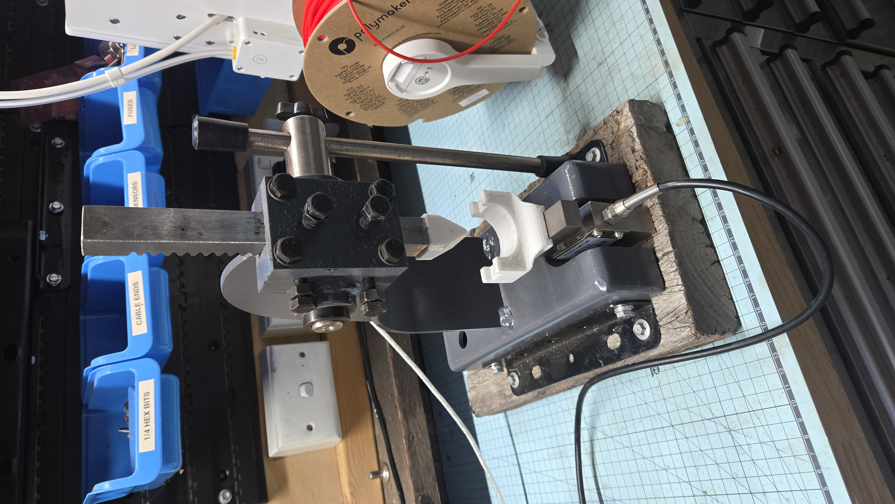
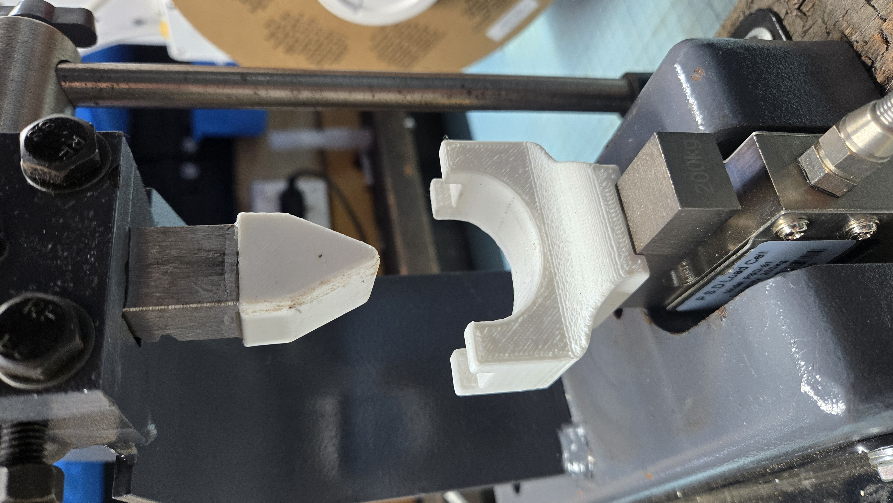

# Load Cell Arbor Press

A force-measurement system that combines an arbor press with an S-type load cell, HX711 amplifier, Arduino Uno, and touchscreen display.

The system was developed for classroom experiments investigating how 3D-printing settings affect part strength. It measures applied force, displays the reading in newtons, and records the peak force reached before a test piece fails.



## Project Status

- **Hardware build:** Complete
- **Load-cell calibration:** Complete
- **Arduino software:** Available
- **Photos and wiring diagrams:** In progress
- **Build and calibration notes:** In progress
- **Example test data:** In progress

## Project Videos

The videos below document the project's development in chronological order.

1. [DIY Force Measuring System for an Arbor Press – Arduino Load Cell Project](https://youtu.be/N4HvQViltPY)  
   **Build and initial demonstration** — Covers the Arduino, touchscreen, HX711 and load-cell setup; arbor-press mounting; construction of the prototype shield; and an initial demonstration of force and peak-load measurement.

2. [Calibrating My Arduino Load Cell for Accurate Force Measurements! | 3D Print Testing Setup](https://youtu.be/z74CdxkSlv4)  
   **Load-cell calibration** — Demonstrates calibration with a known 5 kg mass, updating the calibration factor in the Arduino code, and checking the resulting measurement in newtons.

3. [My Arduino Arbor Press Took a Beating… Now I'm Turning It Into a Testing Machine](https://youtu.be/MyQ4i-kNegI)  
   **Custom test fixture and press conversion** — Documents the conversion of the original classroom press into a controlled destructive-testing machine, including the CAD design and fitting of a custom punch-and-die fixture.

## How It Works

Force applied by the arbor press is transferred through an S-type load cell. The HX711 converts the load-cell signal into data that can be read by the Arduino.

The Arduino then:

- Converts the sensor reading into force
- Displays the current force in newtons
- Records the highest force measured during the test
- Provides controls for zeroing and resetting the measurement

This allows a test piece to be compressed or bent until failure while its peak load is recorded.

### Test Fixture

The removable 3D-printed punch-and-die fixture provides a repeatable way to position specimens between the press ram and the load cell.



## Intended Use

The project is intended for comparative material testing and classroom demonstrations. Example investigations include:

- Comparing different 3D-print infill patterns
- Comparing infill densities
- Investigating wall thickness and layer orientation
- Measuring repeatability between nominally identical parts
- Demonstrating compression, bending and failure
- Exploring stress concentration and test-fixture design

The system is intended as an educational and experimental tool, not as a certified materials-testing instrument.

## Hardware

The build uses:

- Arbor press
- S-type load cell
- HX711 load-cell amplifier and analogue-to-digital converter
- Arduino Uno
- 2.8-inch TFT touchscreen display
- Prototype shield or equivalent wiring
- Mounting brackets and fasteners
- USB power supply or suitable Arduino power source
- 3D-printed test pieces and fixtures

## Repository Structure

```text
code/
  Arduino software for the arbor-press system and calibration tool

docs/
  Wiring diagrams, photographs and build documentation

data/
  Example test data and experimental results
```

Some documentation and data sections remain under development.

## Calibration

The load cell must be calibrated before its readings can be treated as meaningful force measurements.

The calibration process uses a known mass to determine the appropriate calibration factor. That value is then entered into the Arduino software. A 5 kg reference mass should produce a force reading close to:

```text
5 kg × 9.81 m/s² ≈ 49 N
```

Calibration should be checked again whenever the load cell, mounting arrangement, wiring, amplifier or mechanical setup is changed.

See the [calibration video](https://youtu.be/z74CdxkSlv4) for a demonstration of the process.

## Safety

This apparatus deliberately loads test pieces until they deform or fail.

- Secure the arbor press firmly before use.
- Keep hands clear of the press ram and test fixture.
- Wear suitable eye protection.
- Be aware that brittle test pieces may eject fragments.
- Do not exceed the rated capacity of the press, load cell or mounting hardware.
- Inspect the press, fixtures and electrical connections before each session.
- Students should use the apparatus only with appropriate supervision.

## Planned Documentation

Future additions may include:

- Wiring diagram
- Pin-assignment table
- Assembly photographs
- Calibration instructions
- Test-piece drawings or CAD files
- Sample datasets
- Suggested classroom experiments
- Known limitations and measurement uncertainties

## Licence

This project is licensed under the MIT License. See the [LICENSE](LICENSE) file for details.
